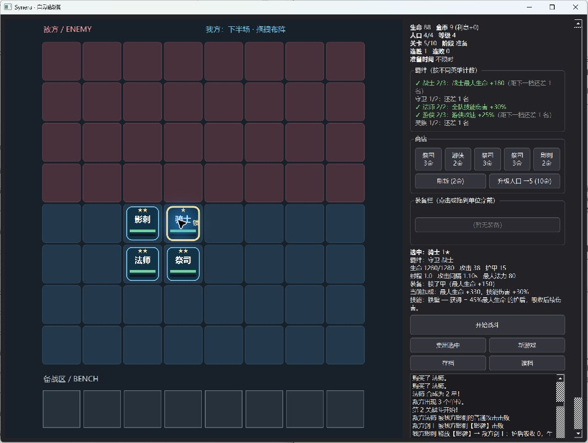
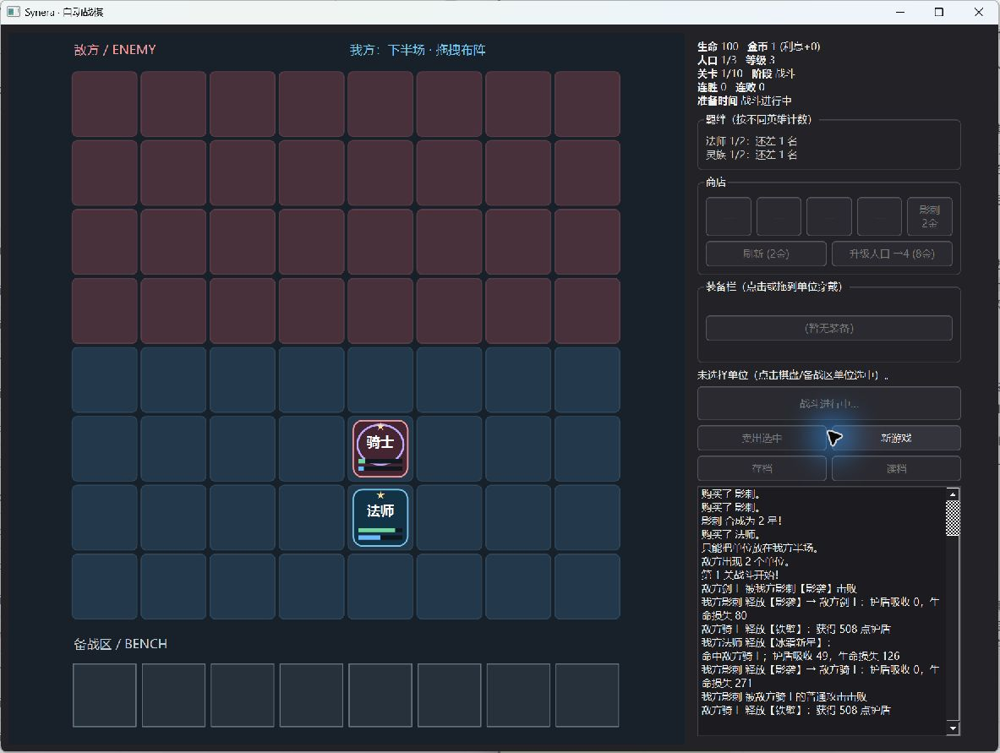

# Synera · Synergy Auto-Arena

[](https://github.com/leiye314/synera/actions/workflows/windows.yml)

一个 **C++17 / Qt 6** 单人 PvE 自走棋学习项目。在准备阶段购买英雄、搭配羁绊和装备、调整阵型，再观察自动战斗，挑战十个预设关卡。侧重可读的游戏规则、对象所有权和可验证的工程实现。

## Screenshot / Demo

以下为原生 Windows 游戏的实际运行截图。所有游戏图形由 QPainter 绘制，无需素材包。





## Features

- Prep → Combat → Resolve 状态循环；胜利推进，失败扣血后重试当前关。
- 8×8 棋盘、8 槽备战区，拖拽上阵、交换、非法落点回弹和人口限制。
- 六种英雄的多态技能：重击、护盾、范围伤害、连射、治疗与突袭。
- 五种羁绊、三合一升星、四种装备；装备支持点击和拖拽穿戴。
- 商店刷新、人口升级、利息及连胜 / 连败收入。
- 准备阶段 JSON 存档、原子替换写入、严格校验与旧版准备存档迁移。
- `--seed 12345` 控制每局随机流；商店、敌方生成和掉落可复现。

操作：点击商店购买 → 从底部备战区拖到蓝色半场 → 点击「开始战斗」。点击单位查看技能和属性；选中后可卖出或点击装备穿戴。也可把装备直接拖到单位上。

## Architecture

```text
Qt Widgets / BoardView       选择、命中、拖拽、显示快照
          ↓ commands          ↑ signals
GameController              阶段转换、命令校验、100 ms 战斗计时器
          ↓
GameState                   Player + Board + Bench + RandomStream
  └─ unique_ptr<Unit>       统一拥有单位，多态技能通过 CombatContext 作用于战场
          ↓
Combat / BFS / Shop / Traits / Equipment / SaveManager
```

| 目录 | 职责 |
| --- | --- |
| `src/core` | 模型、控制器、关卡表、随机流和核心回归 |
| `src/entity` | 英雄目录、属性、装备和技能多态 |
| `src/systems` | 战斗、寻路、经济配套规则与存档 |
| `src/gui` | Qt 窗口、棋盘输入、QPainter 展示 |
| `tests` | 独立核心与 Qt 交互测试入口 |
| `cmake` | Windows 构建目录运行库部署 |

## Technical Highlights

- **明确所有权：** GameState 用 `unique_ptr` 持有单位；Board / Bench 非拥有引用。UnitItem 只保存显示快照，避免卖出、合成或读档后重绘访问失效对象。
- **固定步长战斗：** 每 100 ms 执行索敌、技能 / 攻击、收集并提交移动意图。BFS 使用四邻接方格，射程按格坐标的欧氏距离判断。
- **属性重建：** 羁绊和装备从基础值重算；关卡倍率在战斗初始化时叠加，防止被羁绊刷新覆盖。
- **可复现随机：** 每局独立 `std::mt19937`，定义有界采样映射并保存完整引擎状态。相同版本、种子和操作顺序可复现逻辑结果；不承诺窗口帧时序或跨版本回放兼容。
- **事务式存档：** 输入先解码到临时 GameState，全部校验通过才替换当前状态。使用 [QSaveFile](https://doc.qt.io/qt-6/qsavefile.html) 检查写入长度及提交结果，禁止退回原地截断写入。

## Build / Test

依赖：CMake **3.22+**、C++17 编译器、Qt **6.5+** Core / Gui / Widgets（测试另需 Qt Test）。Windows 本地验证使用 Qt 6.8.1 与匹配的 MinGW 13.1；Qt Creator 也可直接打开 `CMakeLists.txt`。

在已配置编译器和 Qt 的终端中：

```sh
cmake -S . -B build -DCMAKE_PREFIX_PATH="<Qt installation prefix>"
cmake --build build --config Release --parallel
ctest --test-dir build -C Release --output-on-failure
```

Windows MinGW 配置时添加 `-G "MinGW Makefiles" -DCMAKE_BUILD_TYPE=Release`，使用与 Qt Kit 匹配的编译器。Windows 构建会把所需 Qt / MinGW 运行库及平台插件复制到构建目录，可直接运行：

```powershell
.\build\synera.exe --seed 12345
.\run_selftest.ps1 -BuildDir build -Configuration Release
```

多配置生成器的程序通常位于 `build/Release/`。脚本也支持 `-Executable`、`-ReportPath`，相对路径以脚本目录为基准，可从任意工作目录调用；`run_selftest.cmd` 转发相同参数。

独立控制台程序 `synera_selftest --report <path>` 和游戏的 `synera --selftest --report <path>` 使用同一回归套件。测试数据位于自动清理的临时目录。设置 `-DBUILD_TESTING=OFF` 可关闭 CTest 目标；游戏仍保留 `--selftest`。

未传种子时从系统取得新种子，日志会显示数值。「新游戏」重放本次启动的种子；读档则恢复该存档的种子和随机进度。v1 存档仅迁移合法的 Prep 阵容，并以种子 0 开始随机流；Combat / Resolve 快照不支持恢复。准备阶段读档会恢复满血并清除临时战斗状态。

存档对话框默认打开用户文档目录，并在当前窗口内记住最近成功存取的位置，不依赖程序的启动工作目录。

已在 Windows 上完成全新 Release 构建和 CTest：**173 项核心检查**（保留原有 120 项）以及 **5 项 Qt 交互测试**通过。覆盖规则、十关配置、经济结算、确定性战斗与随机流续存、损坏存档拒绝、单位销毁后重绘、拖拽和战斗锁定。游戏内 `--selftest` 与独立入口均通过。Qt Test 报告另包含初始化、清理两个通过项。

GUI 自动化验证覆盖购买、升星、布阵、人口升级、自动战斗、胜负结算、技能与治疗、自然装备掉落、点击 / 拖拽穿戴、卖出返还，以及新游戏后读档恢复。GUI 游玩通过前四关，并验证第五关失败后的准备状态；十关规则有自动回归覆盖，但未完成十关连续人工游玩。Windows GitHub Actions 的 `main` 分支与 `v1.0.0` tag 运行均已验证通过，包含 Release 构建、CTest 和游戏内自测入口。

## Project History

项目始于 Advanced Programming 课程，以课程 Starter 网格与拖拽原型为起点，后续加入战斗、经济、羁绊、装备和存档。公开版本保留已有规则系统，重新实现 Board、GridItem、UnitItem、BoardView 及启动 / 构建薄层；棋盘展示改为与四邻接逻辑一致的方格。

这是一个有明确范围的学习游戏，没有联网、复杂资产管线或完整商业游戏工具链。十关难度来自配置表，尚未完成长期平衡验证。

## Third-party Materials / License

课程历史版曾使用 CraftPix 等第三方素材；公开版因再分发许可考虑未附带，也不搜索或加载这些素材。截图只展示本项目的 QPainter 图形和运行环境字体。

Qt 为外部依赖，仓库不附带 Qt 库。项目当前未指定开源许可证；正式授予他人复用权前，应由作者确认课程来源要求并选择许可。实现重写不替代对来源义务的确认。
